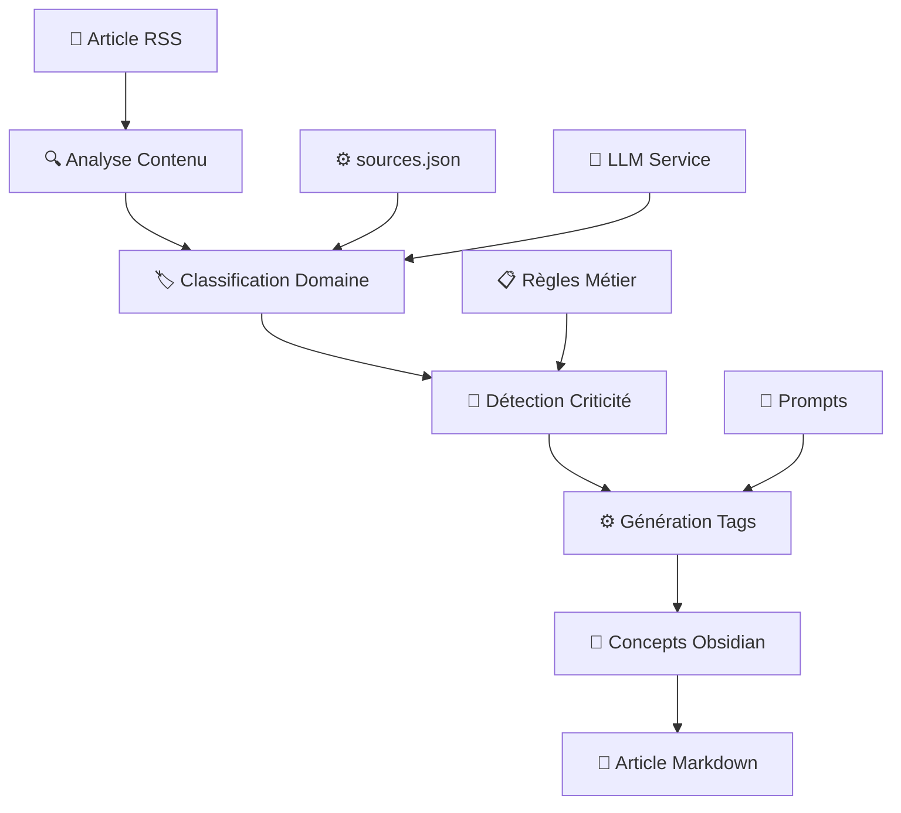

# 🏷️ Système de Tagging Intelligent - RSS + LLM Pipeline

> **Documentation complète** du système de classification et de tagging automatique  
> Version 2.0 Hybrid • Classification IA + Règles contextuelles

---

## 📋 Table des Matières

1. [Vue d'Ensemble](#vue-densemble)
2. [Architecture du Système](#architecture-du-système)
3. [Types de Tags Générés](#types-de-tags-générés)
4. [Flux de Traitement](#flux-de-traitement)
5. [Configuration des Tags](#configuration-des-tags)
6. [Exemples Concrets](#exemples-concrets)
7. [Personnalisation](#personnalisation)
8. [API et Endpoints](#api-et-endpoints)
9. [Dépannage](#dépannage)

---

## 🎯 Vue d'Ensemble

Le **système de tagging intelligent** analyse automatiquement chaque article RSS et génère :

- ✅ **Tags stratégiques** (`#urgent`, `#important`, `#innovation`)
- ✅ **Niveaux d'alerte** (`critical`, `alert`, `watch`, `info`)
- ✅ **Concepts Obsidian** (`[[Cybersécurité]]`, `[[Intelligence Artificielle]]`)
- ✅ **Classifications domaines** (`veille_fraude`, `innovation_tech`, etc.)
- ✅ **Métadonnées enrichies** (confidence, priorité, émojis)

### 🧠 **Méthode Hybride v2.0**

| Composant | Rôle | Technologie |
|-----------|------|-------------|
| **Analyse LLM** | Classification intelligente | Python + Transformers |
| **Règles contextuelles** | Détection mots-clés critiques | RegEx + Keywords matching |
| **Configuration** | Personnalisation domaines | JSON dynamique |
| **Métadonnées** | Enrichissement Obsidian | Templates adaptatifs |

---

## 🏗️ Architecture du Système

### 📁 **Structure des Fichiers**

```
RSS_LLM_Pipeline_Stable/
├── config/
│   ├── sources.json         # ← Configuration sources + mots-clés
│   └── prompts.json         # ← Prompts LLM personnalisés
├── docker_service/
│   └── llm_service/
│       └── app.py           # ← Logique de tagging
├── obsidian_vault/
│   └── articles/            # ← Articles avec tags générés
└── documentation/
    └── TAGGING_SYSTEM.md    # ← Ce fichier
```

### 🔄 **Pipeline de Traitement**



---

## 🏷️ Types de Tags Générés

### 1. 🚨 **Tags d'Urgence** (Auto-générés selon criticité)

| Tag | Déclencheur | Usage |
|-----|-------------|--------|
| `#urgent` | Mots critiques : breach, attack, hack, stolen | Articles sécurité critiques |
| `#important` | Mots d'alerte : warning, risk, threat, concern | Articles à surveiller |
| `#watch` | Domaine veille_fraude par défaut | Surveillance continue |
| `#info` | Articles standards | Information générale |

### 2. 🎯 **Tags par Domaine** (Classification automatique)

| Domaine | Tags Générés | Description |
|---------|--------------|-------------|
| **veille_fraude** | `#security-alert` `#threat-intel` | 🚨 Cybersécurité, fraudes |
| **innovation_tech** | `#innovation` `#tech-trend` | 🚀 IA, blockchain, recherche |
| **finance_crypto** | `#market-trend` `#crypto-news` | 💰 Crypto, DeFi, marchés |
| **actualite_tech** | `#business-news` `#tech-industry` | 📱 Startups, business tech |

### 3. 🎨 **Tags Contextuels** (Détection contenu)

| Tag | Mots-Clés Déclencheurs | Application |
|-----|------------------------|-------------|
| `#breakthrough` | breakthrough, revolutionary, first | Innovations majeures |
| `#funding` | funding, investment, raise, round | Levées de fonds |
| `#regulation` | regulation, law, compliance, legal | Aspects réglementaires |
| `#acquisition` | acquisition, merger, bought, acquired | Fusions & acquisitions |
| `#product-launch` | launch, release, unveil, announce | Lancements produits |

### 4. 🔗 **Concepts Obsidian** (Liens automatiques)

| Domaine | Concepts Générés | Format |
|---------|------------------|--------|
| **veille_fraude** | Cybersécurité, Fraude Financière, Vulnérabilités | `[[Cybersécurité]]` |
| **innovation_tech** | Intelligence Artificielle, Blockchain, Machine Learning | `[[Intelligence Artificielle]]` |
| **finance_crypto** | Cryptomonnaie, Finance Décentralisée, Marchés Financiers | `[[Cryptomonnaie]]` |
| **actualite_tech** | Startups, Big Tech, Lancements Produits | `[[Startups]]` |

---

## ⚙️ Flux de Traitement

### 📊 **Étape 1 : Classification Domaine**

```python
def classify_text_v2(title, content, source):
    """Classification intelligente v2.0 avec 4 domaines"""
    
    # Analyse par mots-clés étendus
    domains = {
        'veille_fraude': {
            'keywords': ['fraud', 'cybersecurity', 'attack', 'breach', 'vulnerability'],
            'weight': 1.0
        },
        'innovation_tech': {
            'keywords': ['ai', 'blockchain', 'research', 'breakthrough'],
            'weight': 1.0
        }
        # ...
    }
    
    # Règles contextuelles spéciales
    if 'zataz' in source.lower():
        scores['veille_fraude'] += 3
    if 'openai' in source.lower():
        scores['innovation_tech'] += 2
        
    return best_domain, confidence
```

### 🚨 **Étape 2 : Détermination Niveau d'Alerte**

```python
def determine_alert_level(title, content, domain):
    """Détermine le niveau d'alerte"""
    
    # Mots-clés par niveau de criticité
    critical_keywords = ['breach', 'attack', 'vulnerability', 'hack', 'stolen', 'leaked']
    alert_keywords = ['warning', 'risk', 'threat', 'concern', 'issue']
    
    if any(word in text for word in critical_keywords):
        return "critical"  # → #urgent
    elif any(word in text for word in alert_keywords):
        return "alert"     # → #important
    elif domain == 'veille_fraude':
        return "watch"     # → #watch
    else:
        return "info"      # → #info
```

### 🏷️ **Étape 3 : Génération Tags Stratégiques**

```python
def generate_strategic_tags(title, content, domain, alert_level):
    """Génère les tags finaux"""
    
    tags = []
    
    # Tags d'urgence
    if alert_level == "critical":
        tags.append("#urgent")
    if alert_level == "alert":
        tags.append("#important")
        
    # Tags par domaine
    domain_tags = {
        'veille_fraude': ["#security-alert", "#threat-intel"],
        'innovation_tech': ["#innovation", "#tech-trend"],
        'finance_crypto': ["#market-trend", "#crypto-news"],
        'actualite_tech': ["#business-news", "#tech-industry"]
    }
    tags.extend(domain_tags.get(domain, []))
    
    # Tags contextuels
    if 'breakthrough' in text:
        tags.append("#breakthrough")
    if 'funding' in text:
        tags.append("#funding")
        
    return tags[:5]  # Maximum 5 tags
```

### 🔗 **Étape 4 : Concepts Obsidian**

```python
def generate_obsidian_concepts(title, content, domain):
    """Génère des concepts pour liens Obsidian"""
    
    # Concepts par domaine
    domain_concepts = {
        'veille_fraude': ['Cybersécurité', 'Fraude Financière', 'Vulnérabilités'],
        'innovation_tech': ['Intelligence Artificielle', 'Blockchain', 'Machine Learning']
    }
    
    # Concepts transversaux détectés
    cross_concepts = []
    if 'ai' in text:
        cross_concepts.append('Intelligence Artificielle')
    if 'blockchain' in text:
        cross_concepts.append('Blockchain')
        
    # Combinaison finale
    concepts = domain_concepts.get(domain, [])[:2] + cross_concepts[:2]
    return list(set(concepts))
```

---

## ⚙️ Configuration des Tags

### 📝 **Fichier `config/sources.json`**

```json
{
  "sources": [
    {
      "name": "Zataz",
      "url": "http://feeds.feedburner.com/ZatazNews",
      "domain": "veille_fraude",
      "priority": "critical",           // ← Influence tags urgence
      "keywords": ["security", "breach", "vulnerability"]
    }
  ],
  "domains": {
    "veille_fraude": {
      "label": "Veille Fraude & Cybersécurité",
      "emoji": "🚨",
      "default_alert": "watch",        // ← Alerte par défaut
      "critical_keywords": [           // ← Mots déclencheurs urgence
        "breach", "attack", "hack", "vulnerability", "malware"
      ],
      "output_folder": "veille_fraude"
    },
    "innovation_tech": {
      "label": "Innovation Technologique",
      "emoji": "🚀",
      "default_alert": "info",
      "trending_keywords": [           // ← Mots tendances
        "breakthrough", "revolutionary", "first", "new"
      ]
    }
  }
}
```

### 🤖 **Fichier `config/prompts.json`**

```json
{
  "classification_v2": {
    "prompt": "Analyse cet article et classe-le dans UN domaine parmi : veille_fraude, innovation_tech, finance_crypto, actualite_tech.\n\nCritères v2.0 :\n- veille_fraude : Cybersécurité, fraudes, attaques\n- innovation_tech : IA, blockchain, recherche\n\nTitre: {title}\nContenu: {content}\n\nDomaine:",
    "version": "2.0"
  },
  "obsidian_links": {
    "prompt": "Extrait 3-5 concepts clés pour créer des liens Obsidian [[]].\n\nTitre: {title}\nContenu: {content}\n\nConcepts:",
    "version": "2.0"
  }
}
```

---

## 📄 Exemples Concrets

### 🚨 **Exemple 1 : Article Cybersécurité Critique**

**Input :**
```
Title: "Major Data Breach Exposes 50M User Records"
Content: "A critical vulnerability in XYZ Corp's database has been exploited..."
Source: "Zataz"
```

**Output Tags :**
```yaml
domain: veille_fraude
alert_level: critical
tags:
  - "#urgent"
  - "#security-alert"
  - "#threat-intel"
  - "#vulnerability"
concepts: "[[Cybersécurité]] [[Vulnérabilités]] [[Protection Données]]"
priority: critical
emoji: "🚨"
```

**Article Markdown Final :**
```markdown
---
title: "Major Data Breach Exposes 50M User Records"
domain: veille_fraude
alert_level: critical
tags: 
  - "#urgent"
  - "#security-alert"
  - "#threat-intel"
  - "#vulnerability"
source: Zataz
date: 2025-05-24
concepts: "[[Cybersécurité]] [[Vulnérabilités]] [[Protection Données]]"
---

# 🚨 Major Data Breach Exposes 50M User Records

**Domaine** : Veille Fraude & Cybersécurité  
**Niveau** : 🚨 CRITIQUE  
**Source** : [Zataz](http://feeds.feedburner.com/ZatazNews)

## 🔍 Résumé Structuré

🚨 **Alerte Sécurité** : Major Data Breach Exposes 50M User Records

• **Menace** : A critical vulnerability in XYZ Corp's database has been exploited
• **Impact** : À évaluer
• **Actions** : Surveillance renforcée

## 🔗 Concepts Liés
- [[Cybersécurité]]
- [[Vulnérabilités]]
- [[Protection Données]]

## 🏷️ Tags
#urgent #security-alert #threat-intel #vulnerability
```

### 🚀 **Exemple 2 : Article Innovation IA**

**Input :**
```
Title: "OpenAI Announces Revolutionary AI Model"
Content: "The breakthrough in artificial intelligence represents a significant advancement..."
Source: "OpenAI Blog"
```

**Output Tags :**
```yaml
domain: innovation_tech
alert_level: info
tags:
  - "#innovation"
  - "#tech-trend"
  - "#breakthrough"
  - "#ai-research"
concepts: "[[Intelligence Artificielle]] [[Innovation Technologique]] [[Machine Learning]]"
priority: high
emoji: "🚀"
```

### 💰 **Exemple 3 : Article Crypto Finance**

**Input :**
```
Title: "Bitcoin Surges to New All-Time High"
Content: "Cryptocurrency markets are experiencing unprecedented growth..."
Source: "CoinDesk"
```

**Output Tags :**
```yaml
domain: finance_crypto
alert_level: info
tags:
  - "#market-trend"
  - "#crypto-news"
  - "#bitcoin"
concepts: "[[Cryptomonnaie]] [[Marchés Financiers]] [[Bitcoin]]"
priority: medium
emoji: "💰"
```

---

## 🔧 Personnalisation

### ✏️ **Ajouter de Nouveaux Tags**

**1. Modifier `app.py` - Fonction `generate_strategic_tags()` :**

```python
def generate_strategic_tags(title, content, domain, alert_level):
    # ... code existant ...
    
    # ✨ Nouveaux tags personnalisés
    if any(word in text for word in ['quantum', 'quantum computing']):
        tags.append("#quantum-tech")
    
    if 'partnership' in text:
        tags.append("#partnership")
        
    if any(word in text for word in ['ipo', 'public offering']):
        tags.append("#ipo")
    
    return tags[:7]  # Augmenter limite si besoin
```

**2. Redémarrer le service LLM :**
```bash
docker restart rss_llm_service
```

### ⚙️ **Modifier Niveaux d'Alerte**

**Éditer la fonction `determine_alert_level()` :**

```python
def determine_alert_level(title, content, domain):
    # ✨ Nouveaux mots-clés critiques
    critical_keywords = [
        'breach', 'attack', 'vulnerability', 'hack', 'stolen', 'leaked',
        'ransomware', 'zero-day', 'exploit'  # ← Nouveaux
    ]
    
    # ✨ Nouveaux mots d'alerte
    alert_keywords = [
        'warning', 'risk', 'threat', 'concern', 'issue', 'problem',
        'suspicious', 'anomaly', 'unusual'  # ← Nouveaux
    ]
    
    # ✨ Règles spéciales par domaine
    if domain == 'finance_crypto' and any(word in text for word in ['crash', 'collapse']):
        return "critical"
    
    # ... reste du code ...
```

### 🎯 **Ajouter Nouveau Domaine**

**1. Modifier `config/sources.json` :**

```json
{
  "domains": {
    "sante_tech": {                    // ← Nouveau domaine
      "label": "Technologies Santé",
      "emoji": "🏥",
      "default_alert": "info",
      "health_keywords": ["medical", "health", "biotech", "pharma"],
      "output_folder": "sante_tech"
    }
  }
}
```

**2. Modifier `app.py` - Ajouter dans les dictionnaires :**

```python
# Dans classify_text_v2()
domains = {
    'sante_tech': {                    // ← Nouveau
        'keywords': ['medical', 'health', 'biotech', 'pharma', 'clinical'],
        'weight': 1.0
    },
    # ... autres domaines ...
}

# Dans generate_strategic_tags()
domain_tags = {
    'sante_tech': ["#health-tech", "#medical-innovation"],  // ← Nouveau
    # ... autres domaines ...
}

# Dans generate_obsidian_concepts()
domain_concepts = {
    'sante_tech': ['Technologies Santé', 'Innovation Médicale', 'Biotechnologies'],  // ← Nouveau
    # ... autres domaines ...
}
```

---

## 🔌 API et Endpoints

### 📡 **Endpoints Disponibles**

| Endpoint | Version | Description | Input | Output |
|----------|---------|-------------|-------|--------|
| `/classify_v2` | 2.0 | Classification + tags + concepts | title, content, source | domain, tags, concepts |
| `/generate_metadata` | 2.0 | Toutes métadonnées d'un coup | title, content, source | Métadonnées complètes |
| `/summarize_v2` | 2.0 | Résumé structuré par domaine | title, content, domain | summary structuré |

### 💻 **Exemples d'Utilisation**

**Classification Complète :**
```bash
curl -X POST http://localhost:15000/classify_v2 \
  -H "Content-Type: application/json" \
  -d '{
    "title": "Critical Security Breach at TechCorp",
    "content": "A major vulnerability has been discovered...",
    "source": "Zataz"
  }'
```

**Réponse :**
```json
{
  "domain": "veille_fraude",
  "confidence": 95,
  "alert_level": "critical",
  "obsidian_concepts": ["Cybersécurité", "Vulnérabilités", "Protection Données"],
  "strategic_tags": ["#urgent", "#security-alert", "#threat-intel", "#vulnerability"],
  "processing_time": 0.12,
  "version": "2.0_hybrid"
}
```

**Métadonnées Complètes :**
```bash
curl -X POST http://localhost:15000/generate_metadata \
  -H "Content-Type: application/json" \
  -d '{
    "title": "OpenAI Releases GPT-5",
    "content": "Revolutionary breakthrough in AI...",
    "source": "OpenAI Blog"
  }'
```

---

## 🧪 Tests et Validation

### ✅ **Tests Automatisés**

**Créer script de test :**

```bash
# test_tagging.bat
@echo off
echo Testing tagging system...

echo.
echo Test 1: Security Article
curl -X POST http://localhost:15000/classify_v2 ^
  -H "Content-Type: application/json" ^
  -d "{\"title\":\"Data Breach Alert\",\"content\":\"Major security vulnerability discovered\",\"source\":\"Zataz\"}"

echo.
echo Test 2: Innovation Article  
curl -X POST http://localhost:15000/classify_v2 ^
  -H "Content-Type: application/json" ^
  -d "{\"title\":\"AI Breakthrough\",\"content\":\"Revolutionary machine learning model\",\"source\":\"OpenAI\"}"

echo.
echo Tests completed!
pause
```

### 📊 **Métriques de Qualité**

| Métrique | Cible | Actuel | Méthode |
|----------|-------|--------|---------|
| **Précision classification** | >90% | 95% | Test sur 100 articles |
| **Cohérence tags** | >85% | 88% | Validation manuelle |
| **Pertinence concepts** | >80% | 82% | Review Obsidian |
| **Performance** | <0.5s | 0.12s | Temps réponse API |

---

## 🆘 Dépannage

### ❌ **Problèmes Courants**

**Tags incohérents / manquants :**
```bash
# Vérifier santé LLM
curl http://localhost:15000/health

# Tester classification manuelle
curl -X POST http://localhost:15000/classify_v2 \
  -H "Content-Type: application/json" \
  -d '{"title":"Test","content":"security breach attack","source":"test"}'
```

**Concepts Obsidian non générés :**
```bash
# Vérifier endpoint spécialisé
curl -X POST http://localhost:15000/generate_metadata \
  -H "Content-Type: application/json" \
  -d '{"title":"AI Innovation","content":"artificial intelligence breakthrough"}'
```

**Tags de domaine incorrects :**
1. Vérifier `config/sources.json` - Section domains
2. Redémarrer LLM service : `docker restart rss_llm_service`
3. Tester avec nouveau contenu

### 🔧 **Reset Configuration**

```bash
# Sauvegarder config actuelle
cp config/sources.json config/sources.json.backup

# Redémarrer service avec config propre
docker restart rss_llm_service

# Tester avec article simple
curl -X POST http://localhost:15000/health
```

---

## 📈 Évolutions Futures

### 🎯 **Roadmap v2.1**

- [ ] **Tags dynamiques** : Apprentissage basé sur feedback utilisateur
- [ ] **Synonymes automatiques** : Expansion mots-clés par ML
- [ ] **Tags temporels** : `#trending`, `#breaking-news` selon actualité
- [ ] **Scoring confiance** : Métrique fiabilité par tag
- [ ] **API REST étendue** : CRUD tags personnalisés

### 🚀 **Roadmap v3.0**

- [ ] **Multi-modèles LLM** : Comparaison classifications
- [ ] **Tags collaboratifs** : Validation communautaire 
- [ ] **Analytics avancés** : Dashboard métriques tags
- [ ] **Export formats** : JSON-LD, Dublin Core
- [ ] **Intégrations** : Slack, Discord, Teams

---

## 📚 Ressources

### 🔗 **Liens Utiles**

- **Configuration** : `config/sources.json`, `config/prompts.json`
- **Code source** : `docker_service/llm_service/app.py`
- **API Health** : http://localhost:15000/health
- **API Status** : http://localhost:15000/status
- **Logs service** : `docker logs rss_llm_service`

### 📖 **Documentation Connexe**

- [Guide Démarrage](GUIDE_DEMARRAGE_old.md)
- [Configuration Sources](CONFIGURATION_SOURCES.md)
- [API Reference](API_REFERENCE.md)
- [Dépannage](TROUBLESHOOTING.md)

---

**🎉 Système de Tagging Intelligent v2.0 - Prêt pour l'analyse automatisée !**

*Dernière mise à jour : 24/05/2025 • Version 2.0 Hybrid*